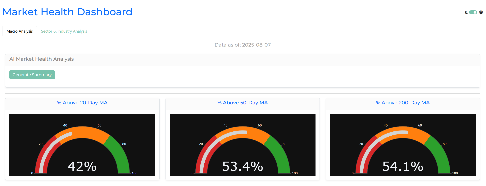
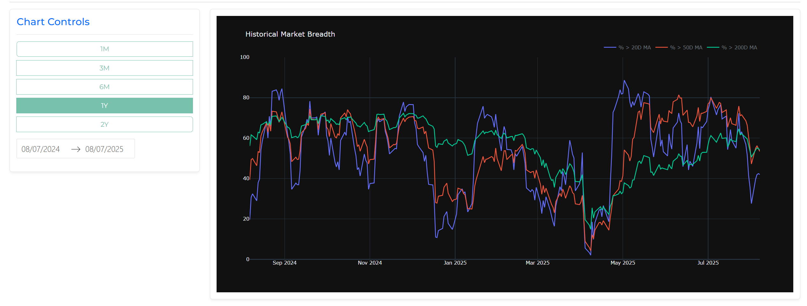
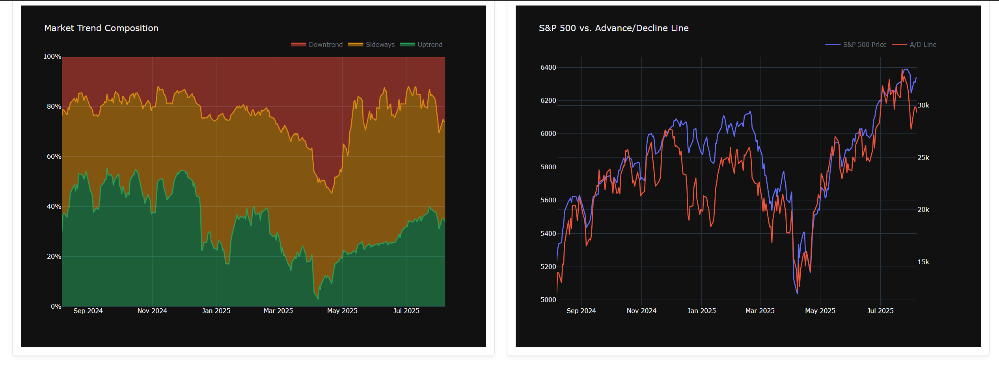
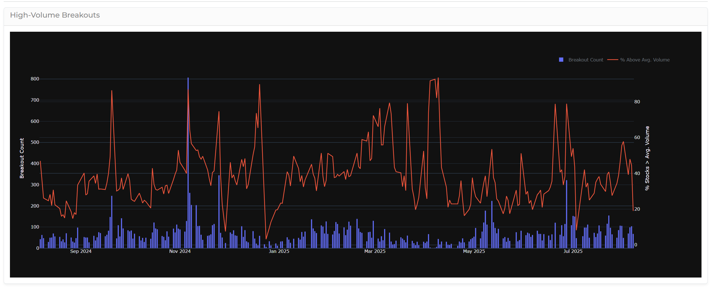
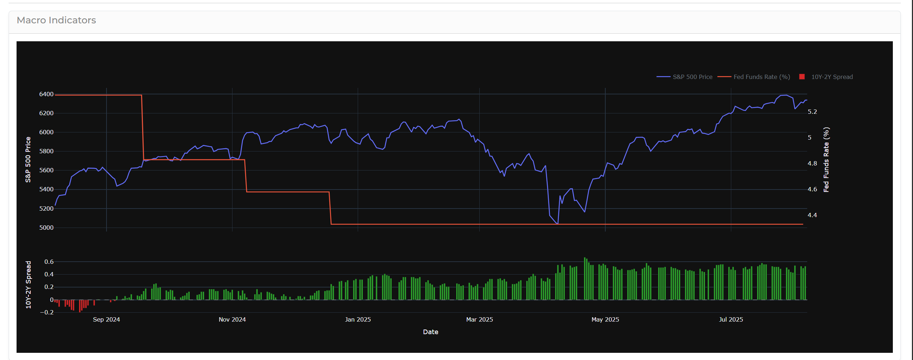
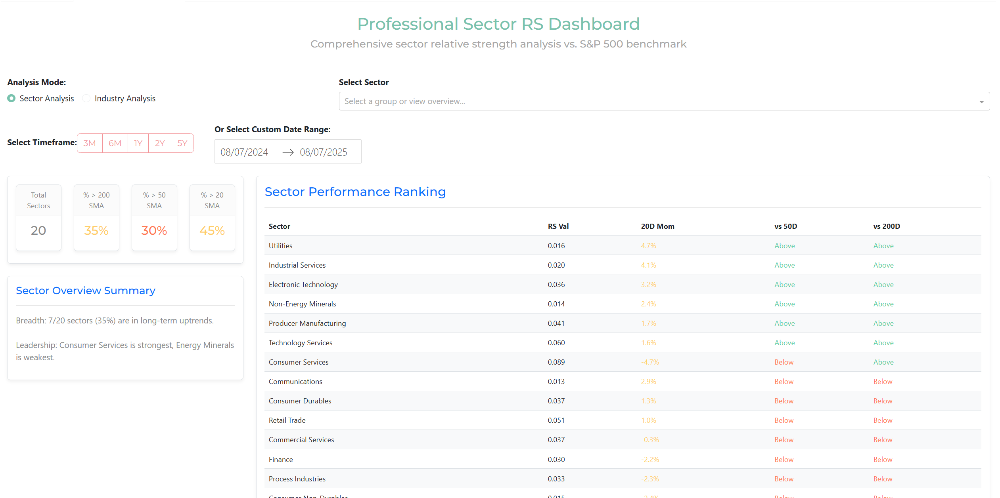

# US Market Health Dashboard

An end-to-end data pipeline and web dashboard for analyzing US stock market health. The system automates data ingestion (yfinance, FRED) and computes technical/macro indicators. Features a Plotly Dash UI and a Gemini-powered AI analyst for data-driven summaries.

## Dashboard Preview

The dashboard provides a comprehensive, multi-faceted view of the market. The Macro tab focuses on high-level health indicators, while the Meso tab allows for deep dives into sector, industry, and individual stock performance.

<table>
  <tr>
    <td align="center"><em>Macro View - Health Gauges & AI Summary</em></td>
    <td align="center"><em>Macro View - Historical & Macro Charts</em></td>
    <td align="center"><em>Meso View - Industry Performance Ranking</em></td>
  </tr>
  <tr>
    <td></td>
    <td></td>
    <td></td>
  </tr>
  <tr>
    <td align="center"><em>Meso View - Group RS & Momentum Analysis</em></td>
    <td align="center"><em>Meso View - Relative Strength Leaders Table</em></td>
    <td align="center"><em>Dark Mode Theme</em></td>
  </tr>
  <tr>
    <td></td>
    <td></td>
    <td></td>
  </tr>
</table>

## Key Features

- **Automated & Incremental Data Pipeline:** Efficiently downloads and updates daily stock prices and corporate actions. It intelligently checks for splits/dividends and only re-downloads data for affected stocks, making daily runs extremely fast.
- **Comprehensive Analytics Engine:** Computes dozens of indicators, including:
    - Market Breadth (% of stocks above key moving averages)
    - Relative Strength (vs. S&P 500)
    - Sector & Industry Group Analysis (Market-cap weighted)
    - Trend Analysis
    - High-Volume Breakouts
- **Macroeconomic Integration:** Fetches and integrates key economic data from FRED (e.g., interest rates, yield curve) for a complete market picture.
- **AI-Powered Analyst:** Integrates with Google's Gemini API to provide sophisticated, data-driven summaries of market health, including trend analysis and identification of risks.
- **Interactive Dashboard:** A multi-tab web interface built with Plotly Dash for visualizing all indicators, from high-level gauges to detailed sector rankings.
- **Scalable Architecture:** The backend data pipelines and the frontend dashboard are designed to be memory-efficient and handle a growing database without performance degradation.

## Technology Stack

- **Backend:** Python, Pandas, NumPy, SQLAlchemy
- **Data Sources:** yfinance, FRED API, TradingView
- **AI:** Google Gemini API
- **Database:** PostgreSQL
- **Dashboard:** Plotly Dash, Dash Bootstrap Components

## Setup & Installation

Follow these steps to get the project running locally.

1.  **Clone the Repository:**
    ```bash
    git clone https://github.com/Ak0096/market-health-dashboard.git
    cd market-health-dashboard
    ```

2.  **Create a Virtual Environment & Install Dependencies:**
    ```bash
    # Create a virtual environment
    python -m venv venv
    
    # Activate it (Windows)
    venv\Scripts\activate
    
    # Install required libraries
    pip install -r requirements.txt
    ```

3.  **Set Up the PostgreSQL Database:**
    - Ensure you have a running PostgreSQL instance.
    - Create a new, empty database (e.g., `us_market_db`).
    - Execute the `schema.sql` file against your new database. This will create all the necessary tables. You can do this using a tool like DBeaver/pgAdmin or the `psql` command-line tool:
      ```bash
      psql -U your_username -d your_database_name -f schema.sql
      ```

4.  **Configure the Application:**
    - **API Keys:** Create a file named `.env` in the project's root directory. This file will hold your secret API keys. Add the following lines, replacing the placeholders with your actual keys:
      ```
      GEMINI_API_KEY="your_google_gemini_api_key"
      FRED_API_KEY="your_fred_api_key"
      ```
    - **Database Connection:** In the `Data Collection` directory, rename `config.example.json` to `config.json`. Edit the new `config.json` file and fill in your PostgreSQL database credentials (`user`, `password`, `dbname`).

## Usage

The system is a two-stage process: first, run the backend pipelines to populate the database, then launch the web dashboard to view the results.

1.  **Run the Data Pipeline (Fetches Raw Data):**
    This script downloads all necessary stock and macro data. Run it the first time to do a full download. Subsequent runs will be fast incremental updates.
    ```bash
    python "Data Collection/data_pipeline.py"
    ```

2.  **Run the Analytics Pipeline (Computes Indicators):**
    This script reads the raw data and computes all the analytical metrics.
    ```bash
    python "Data Collection/compute_analytics.py"
    ```

3.  **Launch the Dashboard:**
    Once the pipelines have completed successfully, you can start the web server.
    ```bash
    python Dashboard/index.py
    ```
    Navigate to `http://127.0.0.1:8050` in your web browser to view the dashboard.